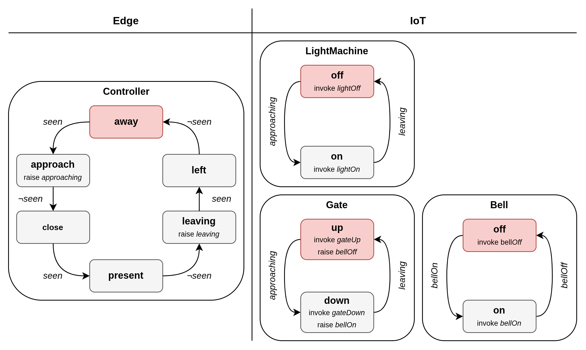

# Akka Railway-Crossing Use Case



## Configuration

The application is expecting a file path as argument to load the configuration from a JSON file.

### JSON Configuration Structure

The configuration is structured as follows:

* **crossings**: A Map that contains for each node-id all Crossings relevant to this node. Each element is structured:
  * **NodeId**: List of Crossings: 
      * **crossingId**: The unique identifier for this Railway-Crossing.
      * **components**: A list of components to be created for the Railway-Crossing. Available components:
          * `Controller`
          * `LightMachine`
          * `Gate`
          * `Bell`
* **service_server_addr**: The host of the Railway-Service.
* **service_server_port**: The port of the Railway-Service.
* **nats_server_addr**: The host of the Nats-Server.
* **nats_server_port**: The port of the Nats-Server.
* **export_server_addr**: The host of the service that collects OpenTelemetry metrics (currently unused).
* **export_server_port**: The port of the service that collects OpenTelemetry metrics (currently unused).
### Example

```json
{
  "crossings": {
    "0": [
      {
        "crossingId": "crossing0",
        "components": [
          "Controller"
        ]
      }
    ],
    "1": [
      {
        "crossingId": "crossing0",
        "components": [
          "LightMachine",
          "Gate"
        ]
      }
    ],
    "2" : [
      {
        "crossingId": "crossing0",
        "components": [
          "Bell"
        ]
      }
    ]
  },
  "service_server_addr": "akka-railway-service",
  "service_server_port": 8000,
  "nats_server_addr": "nats-server",
  "nats_server_port": 4222,
  "export_server_addr": "telegraf",
  "export_server_port": 4317
}
```

## Running locally

```bash
    docker compose up -d
```

Check the logs of each Akka-Node:

```bash
    docker logs railway-crossing-akka-seed-node-1
```

### InfluxDB

* Username: admin
* Password: adminadmin

Visit [InfluxDB](http://localhost:8086)

## Running on multiple EC2 instances with Terraform

The current Terraform setup creates and connects the following instances:

| Number | Instance                  | Applications hosted     | 
|:-------|:--------------------------|:------------------------|
| 1      | Nats-Instance             | Nats                    |
| 1      | OpenTelemetry-Instance    | Telegraf & InfluxDB     |
| 1      | Railway-Service-Instance  | Railway-Service         |
| 1      | Akka-Seed-Instance        | ActorSystem (Seed Node) |
| 2      | Akka-Worker-Instance      | ActorSystem             |
| 1      | Simulate-Sensors-Instance | Simulate-Sensors        |                  

Within the Akka-Cluster there exists one Crossing with id *crossing0*:
* `Controller` at Akka-Seed-Instance
* `LightMachine` and `Gate` at Akka-Worker-Instance-1
* `Bell` at Akka-Worker-Instance-1

### Deploy this Example

1. Install and configure **AWS CLI**
2. Install **Terraform**
3. Initialize **Terraform**:
   ```bash
    (cd ./terraform && terraform init)
    ```
4. Apply **Terraform**:
    ```bash
    (cd ./terraform && terraform apply -auto-approve)
    ```

You may connect via SSH to the created Instances with the created *railway-crossing-key.pem*.

### InfluxDB

* Username: admin
* Password: adminadmin

Terraform will output the public dns of the created Instances. You may connect to the InfluxDB to receive metrics:

```
<openTelemetry_public_dns>:8086
```

### Changing the Example

* Instances: You may change the number of Akka-Instances within the *./terraform/akka-instances.tf* file by changing the count value of the Akka-Workers.
* Configuration: For each Akka-Worker a configuration entry has to be present.