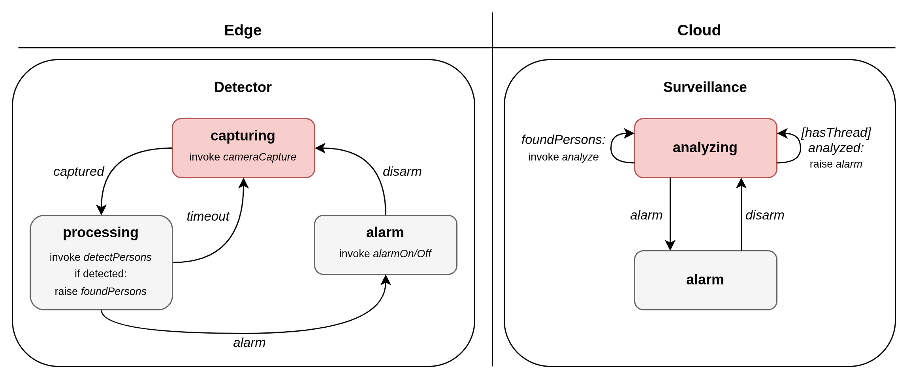

# Akka Surveillance-System Use Case



## Configuration

The application is expecting a file path as argument to load the configuration form a JSON file.

### JSON Configuration Structure

* *node_configs*: A map that contains the component configuration for each Node
  * *detectorsConfigs* - A list of all *Detector* components that will be started on this node:
    * *detectorId* - The unique identifier for this *Detector* component
    * *cameraId* - An identifier that is passed to the IoT-Service to capture an image from a camera
    * *surveillanceId* - The identifier of the *Surveillance* component that will do further image processing
* *surveillanceConfigs* - A list of all *Surveillance* components that will be started on this node:
  * *surveillanceId* - The unique identifier for this *Surveillance* component
* *cloud_service_addr* - The host of the Cloud-Service.
* *cloud_service_port* - The port of the Cloud-Service.
* *edge_service_addr* - The host of the Edge-Service.
* *edge_service_port* - The port of the Edge-Service.
* *iot_service_addr* - The host of the IoT-Service.
* *iot_service_port* - The port of the IoT-Service.

### Example

```json
{
  "node_configs": {
    "0": {
      "detectorConfigs": [
        {
          "detectorId": "detector01",
          "cameraId": 1,
          "surveillanceId": "surveillance01"
        },
        {
          "detectorId": "detector02",
          "cameraId": 2,
          "surveillanceId": "surveillance01"
        }
      ],
      "surveillanceConfigs": []
    },
    "1": {
      "detectorConfigs": [],
      "surveillanceConfigs": [
        {
          "surveillanceId": "surveillance01"
        }
      ]
    }
  },
  "cloud_service_addr": "cloud-service",
  "cloud_service_port": 8000,
  "edge_service_addr": "edge-service",
  "edge_service_port": 8000,
  "iot_service_addr": "iot-service",
  "iot_service_port": 8000
}
```

If the application is started with node id 0 and this configuration file it will:

- Create two *Detector* components that will forward their processed images to the *Surveillance* component with id *surveillance01*
- Create one *Surveillance* component with id *surveillance01*
- Send Cloud-Service-Invocations to *http://localhost:8003/<some-endpoint>*
- Send Edge-Service-Invocations to *http://localhost:8002/<some-endpoint>*
- Send IoT-Service-Invocations to *http://localhost:8001/<some-endpoint>*

Note that a component will only be started if all other components it depends on have been started:

- *Detector* depends on *Surveillance*

## Running locally

```bash
    docker compose up -d
```


Check the logs of each Akka-Node:

```bash
    docker logs surveillance-system-akka-seed-node-1
```

```bash
    docker logs surveillance-system-akka-worker-1-1
```

## Run on EC2

The current Terraform setup creates and connects the following instances:

| Number | Instance                  | Applications hosted                               | 
|:-------|:--------------------------|:--------------------------------------------------|
| 1      | Cloud-Service-Instance    | Cloud-Service                                     |
| 1      | Edge-Service-Instance     | Edge-Service                                      |
| 1      | Akka-Seed-Instance        | ActorSystem (Seed Node) <br/>  Local Edge-Service |
| 1      | Akka-Worker-Instance      | ActorSystem <br/>  Local Edge-Service             |

Within the Akka-Cluster there exists:
* `Surveillance` Actor with id *surveillance01* at the Akka-Worker-Instance
* `Detector` Actor with id *detector01* at the Akka-Seed-Instance
* `Detector` Actor with id *detector02* at the Akka-Seed-Instance

### Deploy this Example


1. Install and configure **AWS CLI**
2. Install **Terraform**
3. Initialize **Terraform**:
   ```bash
    (cd ./terraform && terraform init)
    ```
4. Apply **Terraform**:
    ```bash
    (cd ./terraform && terraform apply -auto-approve)
    ```

You may connect via SSH to the created Instances with the created *surveillance-system-key.pem*.

Inspect the Akka applications on EC2:

```bash
    sudo docker logs akka-node
```

### Extending the Example

The number of Instances with Akka-Cluster Members can simply be changed within *./terraform/akka-instances.tf*:

```terraform
#Workers
resource "aws_instance" "Akka-Worker" {
  depends_on = [null_resource.wait_for_cloud_service, null_resource.wait_for_iot_service]

  ami                    = "ami-068c0051b15cdb816"
  instance_type          = "t3.medium"
  key_name               = aws_key_pair.surveillance-system-node.key_name
  vpc_security_group_ids = [aws_security_group.Surveillance-Default.id]

  count = 1 #<-- Create more workers

  user_data = templatefile("${path.module}/scripts/worker.sh.tpl", {
    seed_node_ip = aws_instance.Akka-Seed-Node.private_ip
    node_id = count.index + 1
    config_json = templatefile("${path.module}/configs/config.json.tpl", {
      cloud_service_ip = aws_instance.Cloud-Service.public_ip
      iot_service_ip = aws_instance.IoT-Service.public_ip
    })
  })

  tags = {
    Name = "Akka-Worker-${count.index}"
  }
}
```

For every instance the configuration has to provide an entry within the *node_configs* field.

* Key **0** for Seed-Node
* Key **n** for nth Worker Node

Note: Decreasing the detector_timeout_ms parameter may overload the Edge-Layer leading to an Exception within Akka: Too Many Open Connections
